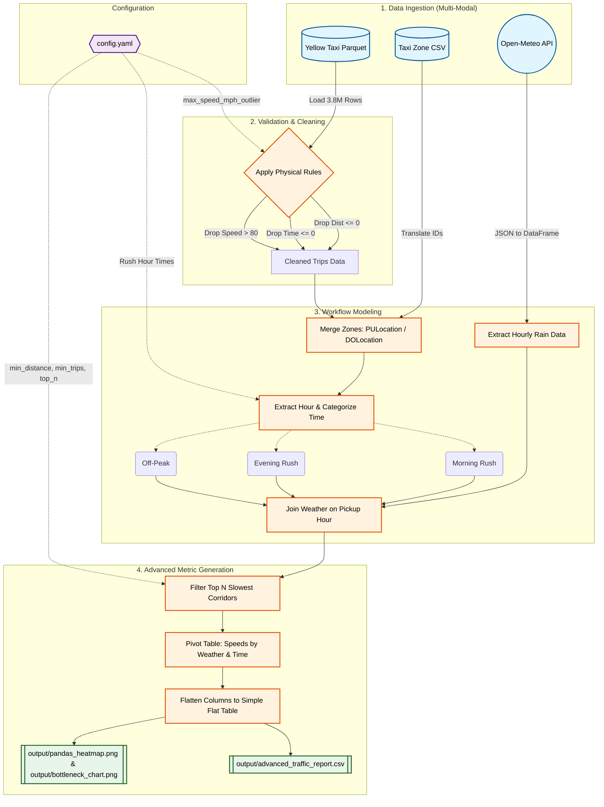

# NYC TLC Traffic Analysis Pipeline (DOT Use Case)

## 1. Problem Statement & Stakeholders
**Stakeholder:** NYC Department of Transportation (DOT)
**Business Problem:** The DOT has a $50M congestion mitigation budget. They need to identify the absolute worst bottleneck routes in the city, and understand exactly how those routes react to **Rush Hour traffic** and **Adverse Weather (Rain)** to know where and when to deploy infrastructure resources (e.g. traffic cops, re-timed lights).
**Decision Supported:** Where to allocate budget, and *when* to halt road construction (e.g., never do road work in Midtown during a rainy evening rush).

## 2. Project KPI & Metrics
**Primary Business KPI:** Average Route Speed (Goal: Increase the average MPH on critical bottlenecks to reduce city-wide congestion).
**Operational Metrics Derived:**
1. **Overall Route Speed (MPH):** Distance divided by time to isolate the worst bottlenecks.
2. **Temporal Impact:** Categorizing trip speeds by time of day (Morning Rush vs Evening Rush).
3. **Weather Impact:** Correlating average route speed with hourly rainfall data.

## 3. Engineering Judgement Call (The FDE Mindset)
During initial data exploration, the absolute slowest routes were found to be "micro-trips" (e.g., trips less than 0.5 miles long). These trips have an inherently slow average speed due to starting, stopping, and waiting at a single red light, which artificially depresses the metric. 
**The FDE Call:** Presenting 3-block micro-trips to the DOT is not actionable. They need to fix structural corridors. Therefore, a **1.5-mile minimum distance filter** was applied to the pipeline aggregation to eliminate the micro-trip noise. 
**Stakeholder Alignment:** Rather than hard-coding this 1.5-mile filter in the engineering logic, this pipeline utilizes a `config.yaml` file. This empowers the DOT stakeholders to define what constitutes a "corridor", taking ownership of the business policy while the pipeline handles the execution.

## 4. Configuration Driven Architecture
All business logic and data cleaning thresholds are abstracted into `config.yaml`. The pipeline dynamically reads these parameters at runtime:
* `max_speed_mph_outlier`: Threshold for removing impossible physics from raw data (Default: 80).
* `morning_rush_start_hour` / `evening_rush_start_hour`: Configurable definitions of Rush Hour.
* `min_total_trips`: Minimum sample size to ensure statistical significance (Default: 1000).
* `min_distance_miles`: The corridor threshold to filter out micro-trips (Default: 1.5).
* `top_n_worst_routes`: The number of bottlenecks to return (Default: 15).

## 5. Key Findings & Output
Below is a snapshot of the top 5 worst traffic corridors in NYC, broken down by weather and time of day.

| Route Corridor | Avg Distance | Overall Speed | Evening Rush (Rain) | Morning Rush (Clear) |
| :--- | :--- | :--- | :--- | :--- |
| Upper East Side South to Garment District | 1.96 mi | **6.08 MPH** | 6.15 MPH | 6.93 MPH |
| Penn Station to Midtown East | 1.52 mi | **6.09 MPH** | 5.50 MPH | 6.22 MPH |
| West Chelsea to Murray Hill | 1.64 mi | **6.11 MPH** | 5.20 MPH | 6.25 MPH |
| East Chelsea to Midtown Center | 1.75 mi | **6.16 MPH** | 5.58 MPH | 6.87 MPH |
| West Chelsea to Midtown Center | 1.81 mi | **6.29 MPH** | 5.87 MPH | 6.60 MPH |

## 6. Source Overview (Multi-Modal Retrieval - Class 5)
We ingest three distinct systems to model the workflow:
1. **Trip Data (Parquet):** `yellow_tripdata_2026-04.parquet` from the official NYC TLC website. This provides the raw transaction grain (1 row = 1 taxi trip).
2. **Zone Data (CSV):** `taxi_zone_lookup.csv` via the NYC TLC AWS CloudFront bucket. Maps arbitrary Location IDs to human-readable neighborhood routes.
3. **Weather Data (REST API):** Open-Meteo Historical API. Fetches hourly precipitation data for April 2026 to correlate rain with traffic speed drops.

## 7. Setup and Run Instructions
1. Ensure Python 3.9+ is installed.
2. Install dependencies: `pip install pandas pyarrow fastparquet jupyter requests matplotlib seaborn pyyaml`
3. Ensure the Parquet and CSV files are in the `data/` directory.
4. (Optional) Adjust business parameters in `config.yaml`.
5. Run the automated pipeline:
   * Open `pipeline_walkthrough.ipynb`
   * Click **Restart Kernel and Run All Cells**
6. The pipeline outputs a flat analytical table: `output/advanced_traffic_report.csv` and visual charts.

## 8. Knowns, Unknowns, Assumptions, and Limitations (Class 6)
* **Assumption (Temporal):** We assumed Rush Hours are 7AM-9AM and 4PM-7PM (configurable in yaml).
* **Assumption (Weather Geospatial):** The weather API uses a single central coordinate for Manhattan (Lat 40.71, Lon -74.00). Since NYC is geographically dense, this is a highly acceptable statistical proxy for city-wide weather in a V1 prototype. A V2 architecture could geocode individual taxi zones for micro-climate accuracy.
* **Assumption (Weather Temporal):** We floor the trip pickup time to the nearest hour to join with the hourly weather API.
* **Limitation (The Smoke Detector):** The Parquet data acts as a smoke detector. It tells us exactly *where* the traffic is (e.g., Midtown East is moving at 3.86 MPH), but it does not tell us *why* (e.g., is it a pothole, a protest, or a car accident?). 
* **Future Work:** To answer the "why", Version 2.0 of this pipeline would require a complex Geospatial Join with the NYC 311 Complaints API or NYPD Collision dataset. 
* **Known (Data Quality):** Raw taxi data contains impossible physics (negative times, 0 distances, 100+ mph speeds). Our pipeline proactively validates and drops these outliers.

## 9. Detailed Pipeline Architecture

