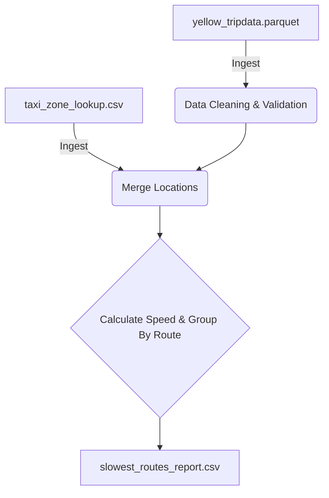

# NYC TLC Traffic Analysis Pipeline (DOT Use Case)

## 1. Problem Statement & Stakeholders
**Stakeholder:** NYC Department of Transportation (DOT)
**Business Problem:** The DOT needs to identify which specific routes and neighborhoods suffer from the most severe traffic congestion in order to prioritize road infrastructure improvements, adjust traffic light timings, and plan construction efficiently. 
**Decision Supported:** Where to allocate the city's $50M congestion mitigation budget for Q3 2026.

## 2. Project KPI & Metrics
**Primary KPI:** Traffic Congestion Severity
**Operational Metrics:**
1. **Average Route Speed (MPH):** Distance divided by time.
2. **Total Trip Volume:** Count of trips on a specific route (to ensure we are looking at statistically significant bottlenecks, not just one-off slow trips).

## 3. Source Overview
We use two distinct data sources (Class 5 - Retrieval):
1. **Trip Data (Parquet):** `yellow_tripdata_2026-04.parquet` from the official NYC TLC website. This contains the raw transaction grain (1 row = 1 taxi trip).
2. **Zone Data (CSV):** `taxi_zone_lookup.csv` via the NYC TLC AWS CloudFront bucket. This maps integer Location IDs to human-readable neighborhood names.

## 4. Setup and Run Instructions
1. Ensure Python 3.9+ is installed.
2. Install dependencies: `pip install pandas pyarrow fastparquet jupyter`
3. Download the data files into a `data/` directory.
4. Run the pipeline via the interactive Jupyter Notebook:
   * Open `pipeline_walkthrough.ipynb`
   * Run cells sequentially to observe data validation, joining, and metric generation.
5. The pipeline will output a final report: `slowest_routes_report.csv`.

## 5. Knowns, Unknowns, Assumptions, and Limitations (Class 6)
* **Assumption:** We assume that Yellow Taxi speed is a reasonable proxy for general traffic speed. (Taxis may drive more aggressively or use bus lanes).
* **Limitation:** The Parquet file does not contain exact GPS paths, only the starting zone and ending zone. We don't know the exact streets taken.
* **Known:** The dataset contains dirty data (e.g., negative times, zero distance, speeds > 100mph). Our pipeline actively drops these impossibilities (approx 144k rows dropped).
* **Unknown:** Weather conditions are unknown. Rain or accidents on specific days in April 2026 could artificially skew the average speed for certain routes.

## 6. Data Model Diagram

