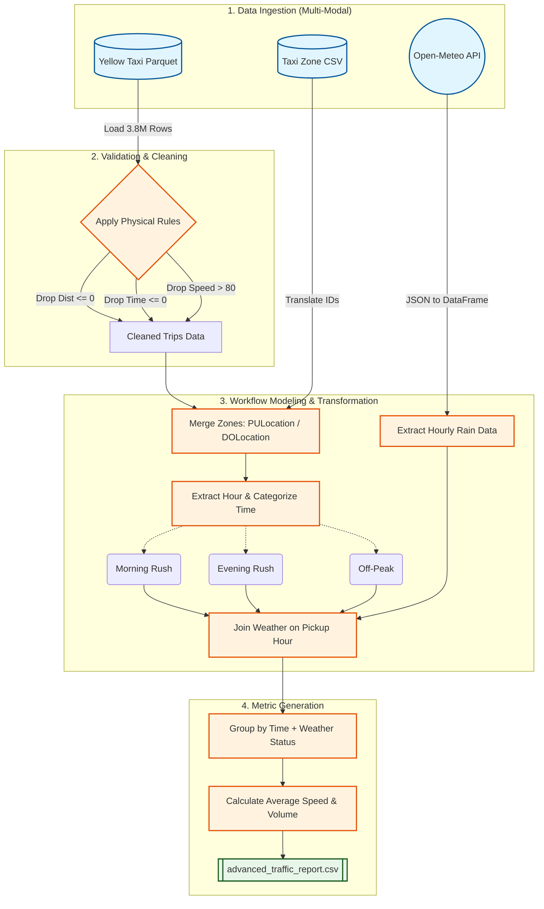

# NYC TLC Traffic Analysis Pipeline (DOT Use Case)

## 1. Problem Statement & Stakeholders
**Stakeholder:** NYC Department of Transportation (DOT)
**Business Problem:** The DOT needs to identify which specific routes and neighborhoods suffer from the most severe traffic congestion in order to prioritize road infrastructure improvements. Furthermore, they need to understand how **Rush Hour** and **Adverse Weather (Rain)** exacerbate these bottlenecks.
**Decision Supported:** Where and when to allocate the city's $50M congestion mitigation budget for Q3 2026.

## 2. Project KPI & Metrics
**Primary KPI:** Traffic Congestion Severity
**Operational Metrics:**
1. **Average Route Speed (MPH):** Distance divided by time.
2. **Temporal Impact:** Categorizing trips by time of day (Morning Rush vs Evening Rush).
3. **Weather Impact:** Correlating average speed with rainfall data.

## 3. Source Overview (Multi-Modal)
We use three distinct data sources (Class 5 - Retrieval):
1. **Trip Data (Parquet):** `yellow_tripdata_2026-04.parquet` from the official NYC TLC website. This contains the raw transaction grain (1 row = 1 taxi trip).
2. **Zone Data (CSV):** `taxi_zone_lookup.csv` via the NYC TLC AWS CloudFront bucket. Maps Location IDs to neighborhood names.
3. **Weather Data (REST API):** Open-Meteo Historical API. Fetches hourly precipitation data for April 2026 to prove weather impacts on traffic.

## 4. Setup and Run Instructions
1. Ensure Python 3.9+ is installed.
2. Install dependencies: `pip install pandas pyarrow fastparquet jupyter requests`
3. Download the Parquet and CSV files into a `data/` directory.
4. Run the pipeline via the interactive Jupyter Notebook:
   * Open `pipeline_walkthrough.ipynb`
   * Run cells sequentially to observe data validation, the API fetch, joining, and metric generation.
5. The pipeline will output a final report: `advanced_traffic_report.csv`.

## 5. Knowns, Unknowns, Assumptions, and Limitations (Class 6)
* **Assumption:** We assume that Yellow Taxi speed is a reasonable proxy for general traffic speed.
* **Assumption (Temporal):** We assumed Rush Hours are 7AM-9AM and 4PM-7PM.
* **Limitation:** The Parquet file does not contain exact GPS paths, only the starting zone and ending zone. We don't know the exact streets taken.
* **Known:** The dataset contains dirty data (e.g., negative times, zero distance, speeds > 100mph). Our pipeline actively drops these impossibilities.

## 6. Detailed Pipeline Architecture

