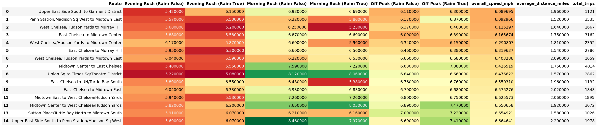
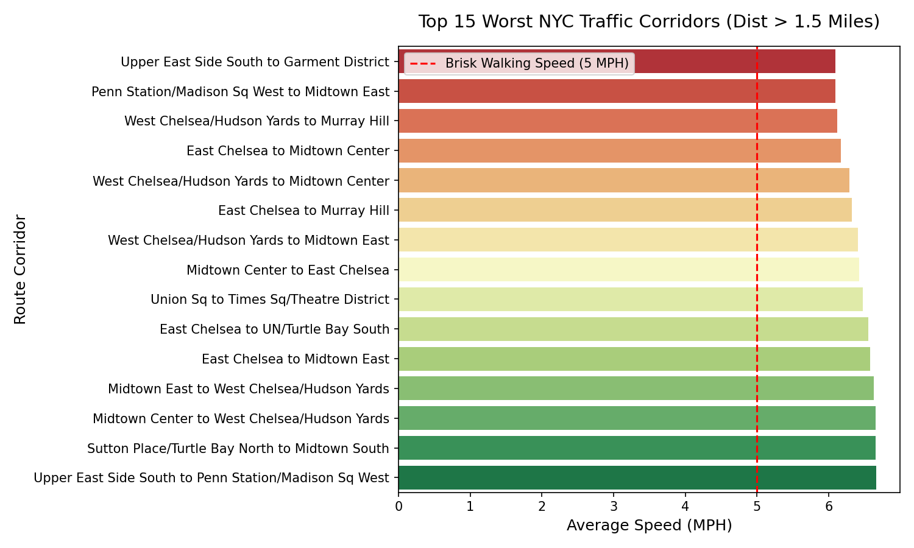
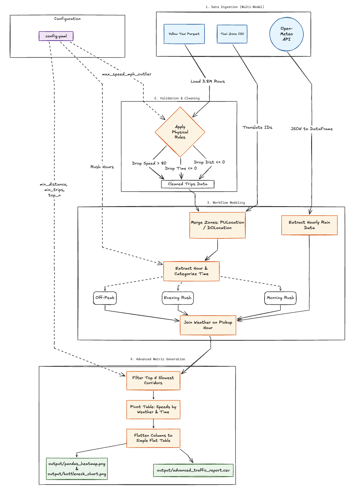

# NYC TLC Traffic Analysis Pipeline (DOT Use Case)

## 1. Problem Statement & Stakeholders
**Stakeholder:** NYC Department of Transportation (DOT)
**Business Problem:** The DOT has a $50M congestion mitigation budget. They are experiencing severe city-wide traffic but have zero visibility into *where* the absolute worst bottlenecks are, or *when* they are most vulnerable to complete gridlock. 
**Decision Supported:** The DOT needs to know exactly **where** to allocate their infrastructure budget (e.g., adding traffic cops, re-timing lights) and **when** to halt road construction to avoid exacerbating delays.

## 2. The FDE Engineering Approach
Stakeholders rarely hand engineers perfectly modeled requirements. To solve the DOT's vague mandate of "fix traffic," this pipeline proactively models two critical external factors that destroy traffic flow:
1. **Temporal Impact:** Categorizing trips into configurable "Rush Hour" vs "Off-Peak" windows.
2. **Environmental Impact:** Joining trip data with an external Weather API to correlate precipitation with severe speed drops.

## 3. Project KPI & Metrics
**Primary Business KPI:** Average Route Speed (Goal: Increase the average MPH on critical bottlenecks to reduce city-wide congestion).
**Operational Metrics Derived:**
To satisfy the business requirement of analyzing traffic workflows, the pipeline calculates 5 core operational metrics for every route:
1. **Average Route Speed (MPH):** The core metric used to rank and identify the most severe bottlenecks (`trip_distance` / `trip_duration`).
2. **Total Route Volume (Trips):** The demand indicator and sample size for the corridor (Minimum 1000 trips required per config).
3. **Average Corridor Distance (Miles):** The physical length of the route, used to filter out non-actionable "micro-trips".
4. **Adverse Weather Speed Delta:** The drop in average speed specifically caused by hourly precipitation (Rain = True vs False).
5. **Rush Hour Speed Delta:** The variance in traffic speeds during configurable peak windows (e.g., 4PM-7PM) versus off-peak hours.

## 3. Engineering Judgement Call
During initial data exploration, the absolute slowest routes were found to be "micro-trips" (e.g., trips less than 0.5 miles long). These trips have an inherently slow average speed due to starting, stopping, and waiting at a single red light, which artificially depresses the metric. 
**The Call:** Presenting 3-block micro-trips to the DOT is not actionable. They need to fix structural corridors. Therefore, a **1.5-mile minimum distance filter** was applied to the pipeline aggregation to eliminate the micro-trip noise. 
**Stakeholder Alignment:** Rather than hard-coding this 1.5-mile filter in the engineering logic, this pipeline utilizes a `config.yaml` file. This empowers the DOT stakeholders to define what constitutes a "corridor", taking ownership of the business policy while the pipeline handles the execution.

## 4. Configuration Driven Architecture
All business logic and data cleaning thresholds are abstracted into `config.yaml`. The pipeline dynamically reads these parameters at runtime:
* `max_speed_mph_outlier`: Threshold for removing impossible physics from raw data (Default: 80).
* `morning_rush_start_hour` / `evening_rush_start_hour`: Configurable definitions of Rush Hour.
* `min_total_trips`: Minimum sample size to ensure statistical significance (Default: 1000).
* `min_distance_miles`: The corridor threshold to filter out micro-trips (Default: 1.5).
* `top_n_worst_routes`: The number of bottlenecks to return (Default: 15).

## 5. Key Findings & Output
Below is a snapshot of the top 5 worst traffic corridors in NYC, broken down by weather and time of day.

| Route Corridor | Avg Distance | Overall Speed | Evening Rush (Rain) | Morning Rush (Clear) |
| :--- | :--- | :--- | :--- | :--- |
| Upper East Side South to Garment District | 1.96 mi | **6.08 MPH** | 6.15 MPH | 6.93 MPH |
| Penn Station to Midtown East | 1.52 mi | **6.09 MPH** | 5.50 MPH | 6.22 MPH |
| West Chelsea to Murray Hill | 1.64 mi | **6.11 MPH** | 5.20 MPH | 6.25 MPH |
| East Chelsea to Midtown Center | 1.75 mi | **6.16 MPH** | 5.58 MPH | 6.87 MPH |
| West Chelsea to Midtown Center | 1.81 mi | **6.29 MPH** | 5.87 MPH | 6.60 MPH |





## 6. Source Overview
We ingest three distinct systems to model the workflow:
1. **Trip Data (Parquet):** `yellow_tripdata_2026-04.parquet` from the official NYC TLC website. This provides the raw transaction grain (1 row = 1 taxi trip).
2. **Zone Data (CSV):** `taxi_zone_lookup.csv` via the NYC TLC AWS CloudFront bucket. Maps arbitrary Location IDs to human-readable neighborhood routes.
3. **Weather Data (REST API):** Open-Meteo Historical API. Fetches hourly precipitation data for April 2026 to correlate rain with traffic speed drops.

## 7. Setup and Run Instructions
1. Ensure Python 3.9+ is installed.
2. Create and activate a virtual environment:
   ```bash
   python3 -m venv venv
   source venv/bin/activate
   ```
3. Install dependencies:
   ```bash
   pip install -r requirements.txt
   ```
4. Ensure the Parquet and CSV files are in the `data/raw/` directory.
5. (Optional) Adjust business parameters in `config/config.yaml`.
6. Run the pipeline. You have two options:
   
   **Option A: Production Execution (Modular)**
   ```bash
   python run_pipeline.py
   ```
   *Generates a date-stamped folder in `data/processed/` containing four artifacts:*
   * `advanced_traffic_report.csv` (Analytic Table)
   * `run_metadata.json` (Configuration parameters used)
   * `pandas_heatmap.png` (Visual Breakdown)
   * `bottleneck_chart.png` (Executive Bar Chart)

   **Option B: Interactive Presentation (Visual)**
   * Open `pipeline_walkthrough.ipynb` in VSCode or Jupyter.
   * Click **Restart Kernel and Run All Cells** to view the dynamic heatmaps and charts inline.

## 8. Knowns, Unknowns, Assumptions, and Limitations
* **Assumption (Temporal):** We assumed Rush Hours are 7AM-9AM and 4PM-7PM (configurable in yaml).
* **Assumption (Weather Geospatial):** The weather API uses a single central coordinate for Manhattan (Lat 40.71, Lon -74.00). Since NYC is geographically dense, this is a highly acceptable statistical proxy for city-wide weather in a V1 prototype. A V2 architecture could geocode individual taxi zones for micro-climate accuracy.
* **Assumption (Weather Temporal):** We floor the trip pickup time to the nearest hour to join with the hourly weather API.
* **Limitation (The Smoke Detector):** The Parquet data acts as a smoke detector. It tells us exactly *where* the traffic is (e.g., Midtown East is moving at 3.86 MPH), but it does not tell us *why* (e.g., is it a pothole, a protest, or a car accident?). 
* **Future Work:** To answer the "why", Version 2.0 of this pipeline would require a complex Geospatial Join with the NYC 311 Complaints API or NYPD Collision dataset. 
* **Known (Data Quality):** Raw taxi data contains impossible physics (negative times, 0 distances, 100+ mph speeds). Our pipeline proactively validates and drops these outliers.

## 9. Detailed Pipeline Architecture

