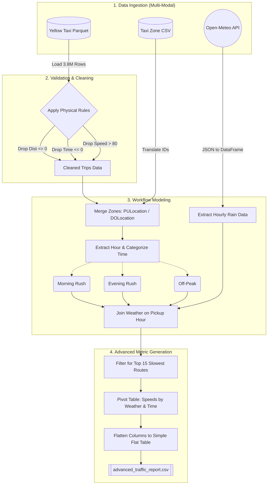

# NYC TLC Traffic Analysis Pipeline (DOT Use Case)

## 1. Problem Statement & Stakeholders
**Stakeholder:** NYC Department of Transportation (DOT)
**Business Problem:** The DOT has a $50M congestion mitigation budget. They need to identify the absolute worst bottleneck routes in the city, and understand exactly how those routes react to **Rush Hour traffic** and **Adverse Weather (Rain)** to know where and when to deploy infrastructure resources (e.g. traffic cops, re-timed lights).
**Decision Supported:** Where to allocate budget, and *when* to halt road construction (e.g., never do road work in Midtown during a rainy evening rush).

## 2. Project KPI & Metrics
**Primary KPI:** Traffic Congestion Severity (Identifying the 15 worst routes)
**Operational Metrics:**
1. **Overall Route Speed (MPH):** Distance divided by time to isolate the worst bottlenecks.
2. **Temporal Impact:** Categorizing trip speeds by time of day (Morning Rush vs Evening Rush).
3. **Weather Impact:** Correlating average route speed with hourly rainfall data.

## 3. Source Overview (Multi-Modal Retrieval - Class 5)
We ingest three distinct systems to model the workflow:
1. **Trip Data (Parquet):** `yellow_tripdata_2026-04.parquet` from the official NYC TLC website. This provides the raw transaction grain (1 row = 1 taxi trip).
2. **Zone Data (CSV):** `taxi_zone_lookup.csv` via the NYC TLC AWS CloudFront bucket. Maps arbitrary Location IDs to human-readable neighborhood routes.
3. **Weather Data (REST API):** Open-Meteo Historical API. Fetches hourly precipitation data for April 2026 to correlate rain with traffic speed drops.

## 4. Setup and Run Instructions
1. Ensure Python 3.9+ is installed.
2. Install dependencies: `pip install pandas pyarrow fastparquet jupyter requests`
3. Ensure the Parquet and CSV files are in the `data/` directory.
4. Run the automated pipeline:
   * Open `pipeline_walkthrough.ipynb`
   * Click **Restart Kernel and Run All Cells**
5. The pipeline outputs a flat analytical table: `advanced_traffic_report.csv` (15 worst routes, broken out by weather and time).

## 5. Knowns, Unknowns, Assumptions, and Limitations (Class 6)
* **Assumption (Temporal):** We assumed Rush Hours are 7AM-9AM and 4PM-7PM.
* **Assumption (Weather):** We floor the trip pickup time to the nearest hour to join with the hourly weather API.
* **Limitation (The Smoke Detector):** The Parquet data acts as a smoke detector. It tells us exactly *where* the traffic is (e.g., Midtown East is moving at 3.86 MPH), but it does not tell us *why* (e.g., is it a pothole, a protest, or a car accident?). 
* **Future Work:** To answer the "why", Version 2.0 of this pipeline would require a complex Geospatial Join with the NYC 311 Complaints API or NYPD Collision dataset. 
* **Known (Data Quality):** Raw taxi data contains impossible physics (negative times, 0 distances, 100+ mph speeds). Our pipeline proactively validates and drops these outliers.

## 6. Detailed Pipeline Architecture

